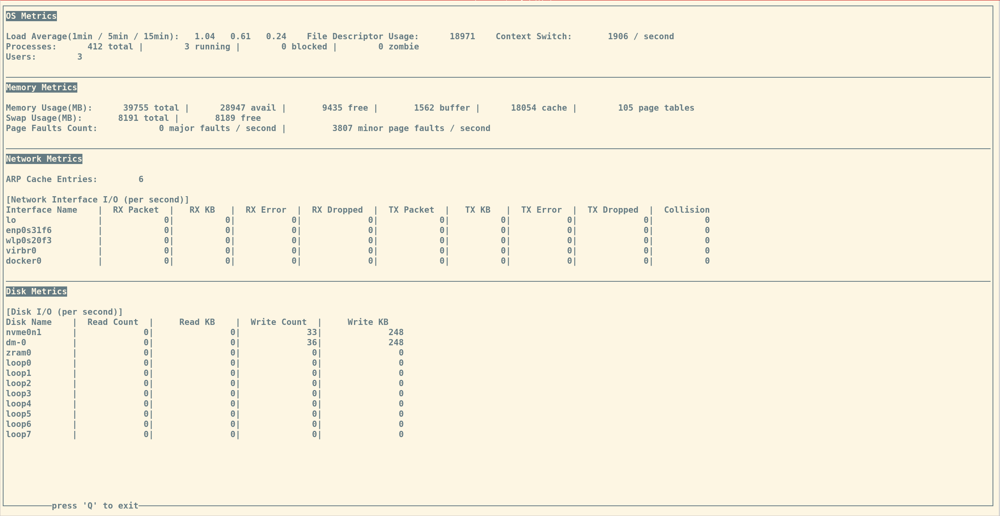

# puppy-eye

## Intro

`puppy-eye` is a local Linux monitoring utility to monitor system load, context switches, memory usage and network interface traffic etc.. It is written in C and utilizing [ncurses](https://invisible-island.net/ncurses/) as the TUI library.

Disk I/O metrics are not included because there are tons of different utilities can show disk I/O usage already.

## Screenshot



## Metrics List

`puppy-eye` reports following metrics:

| Category | Metric Name | Unit | Description |
| --- | --- | --- | --- |
| OS | Load Average 1min | n/a | 1 min load average |
| OS | Load Average 5min | n/a | 5 min load average |
| OS | Load Average 15min | n/a | 15 min load average |
| OS | File Descriptor Usage | count | number of occupied file descriptors |
| OS | Total Number of Processes | count | number of total processes |
| OS | Total Number of Running Processes | count | number of running processes |
| OS | Total Number of Blocked Processes | count | number of blocked processes |
| OS | Total Number of Zombie Processes | count | number of zombie processes |
| OS | Context Switch | count/second | number of context switches per second |
| Memory | Total Memory | MB | total memory |
| Memory | Free memory | MB | free memory |
| Memory | Available Memory | MB | available memory |
| Memory | Buffer | MB | buffer |
| Memory | Cache | MB | cache |
| Memory | Total Swap | MB | total swap space |
| Memory | Free Swap | MB | free swap space |
| Memory | Page Tables | MB | page tables size |
| Memory | Minor Page Faults | count/second | number of minor page faults per second |
| Memory | Major Page Faults | count/second | number of major page faults per second |
| Network | ARP Cache Entries | count | number of ARP cache entries |
| Network | RX KB | KB/second | number of good received bytes per second |
| Network | TX KB | KB/second | number of good transmitted bytes per second |
| Network | RX Dropped | packet/second | number of packets received but dropped per second |
| Network | TX Dropped | packet/second | number of packets dropped in transmission per second |
| Network | RX Error | packet/second | number of bad packets received per second |
| Network | TX Error | packet/second | number of bad packets transmitted per second |
| Network | Collision | count/second | number of packets collisions per second |

## Compilation

```
$ make
gcc -g -Wall -Wextra -Wpedantic -Wconversion -Wdouble-promotion -Wno-unused-parameter -Wno-unused-function -Wno-sign-conversion -fsanitize=undefined -fsanitize-trap -I. -c -o puppy-eye.o puppy-eye.c
gcc -g -Wall -Wextra -Wpedantic -Wconversion -Wdouble-promotion -Wno-unused-parameter -Wno-unused-function -Wno-sign-conversion -fsanitize=undefined -fsanitize-trap -I. -c -o os.o os.c
gcc -g -Wall -Wextra -Wpedantic -Wconversion -Wdouble-promotion -Wno-unused-parameter -Wno-unused-function -Wno-sign-conversion -fsanitize=undefined -fsanitize-trap -I. -c -o memory.o memory.c
gcc -g -Wall -Wextra -Wpedantic -Wconversion -Wdouble-promotion -Wno-unused-parameter -Wno-unused-function -Wno-sign-conversion -fsanitize=undefined -fsanitize-trap -I. -c -o network.o network.c
gcc -g -Wall -Wextra -Wpedantic -Wconversion -Wdouble-promotion -Wno-unused-parameter -Wno-unused-function -Wno-sign-conversion -fsanitize=undefined -fsanitize-trap -I. -c -o utils.o utils.c
gcc -g -Wall -Wextra -Wpedantic -Wconversion -Wdouble-promotion -Wno-unused-parameter -Wno-unused-function -Wno-sign-conversion -fsanitize=undefined -fsanitize-trap -I. -c -o ncurses_utils.o ncurses_utils.c
gcc -g -Wall -Wextra -Wpedantic -Wconversion -Wdouble-promotion -Wno-unused-parameter -Wno-unused-function -Wno-sign-conversion -fsanitize=undefined -fsanitize-trap -I. -o puppy-eye puppy-eye.o os.o memory.o network.o utils.o ncurses_utils.o -lncurses
```

## Usage

Users can simply run `puppy-eye` without any options. The default refresh period is 5 seconds.

```
$ ./puppy-eye -h
Puppy Eye Linux System Monitoring Utility - Version 1.0.2
usage: puppy-eye [-r|--refresh <second(s)>]
                 [-h|--help]
```

`-r` or `--refresh`: specify the refresh period. the unit is second

`-h` or `--help`: show help message

## Known Issues

* In order to keep the screen update properly when users resize the terminal, it is necessary to re-draw and refresh the terminal in each iteration. This may cause screen-flashing a bit
* I am still using `fopen()` and `fclose()` pair to read the metric values from files in each iteration. This helps me handle errors easily. However, the overhead is high and should be re-written in `fseek()` favor to avoid file open / close sequences

## ChangeLog

```
[01/07/2025] 1.0.0 - initial commit

[01/08/2025] 1.0.1 - minor fixes

[01/09/2025] 1.0.2 - fix function declarations
```
